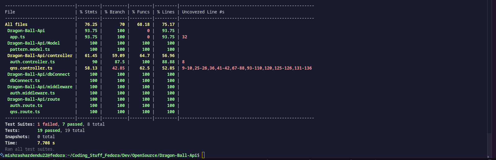

# Testing Documentation – Dragon Ball API

## Results 


## Objective

Implement full coverage across unit, integration, and API-level tests for the Node.js API server.

---

## Directory Structure

```
tests/
├── unit/             # Controller logic tests
├── integration/      # API + Database interaction
└── api/              # Black-box endpoint behavior
```

---

## Unit Tests

* Location: `tests/unit/`
* Focus: Test controller logic in isolation
* Database: Mocked (e.g., using `jest.mock`)
* Goal: ≥ 70% code coverage

Example:

```ts
describe('addQuestion()', () => {
  it('should fail with missing data', async () => {
    const res = await addQuestion(reqMock, resMock);
    expect(resMock.status).toHaveBeenCalledWith(500);
  });
});
```

---

## Integration Tests

* Location: `tests/integration/qns.integration.test.ts`
* Focus: Test real interactions between API and database
* Stack: Jest + Supertest
* Notes: Use actual MongoDB instance or `mongodb-memory-server` if configured

Example:

```ts
it('POST /add → creates new question', async () => {
  const res = await request(app).post('/add').send({
    series: 'Z',
    question: 'What is Goku’s last form?',
    answer: 'Ultra Instinct'
  });
  expect(res.status).toBe(201);
});
```

---

## API Tests

* Location: `tests/api/qns.api.test.ts`
* Focus: Endpoint behavior under typical and edge-case inputs
* Notes: Requires database connection to be active
* Configuration: Extend Jest timeout if needed

Example:

```ts
it('GET /question/1 → returns question or 404', async () => {
  const res = await request(app).get('/question/1');
  expect([200, 404]).toContain(res.status);
});
```

---

## Commands

Run all tests:

```bash
npx jest
```

Run specific test suite:

```bash
npx jest tests/integration/qns.integration.test.ts
```

Generate coverage report:

```bash
npx jest --coverage
```

---

## Tools Used

| Tool      | Purpose                    |
| --------- | -------------------------- |
| Jest      | Test framework             |
| Supertest | HTTP request simulation    |
| ts-jest   | TypeScript + Jest support  |
| MongoDB   | Data layer for integration |

---
